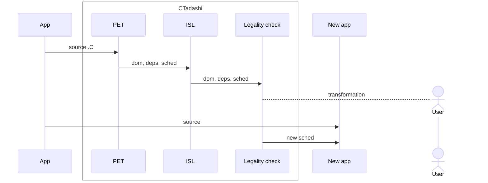
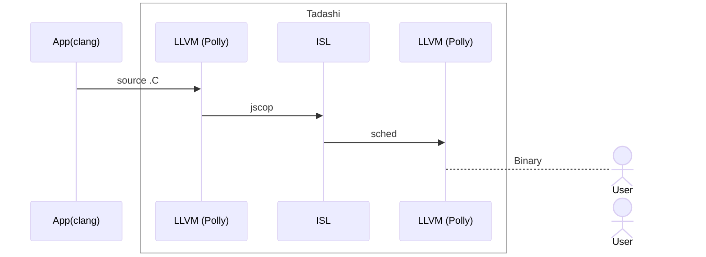

#+startup: beamer
#+include: preamble.org
#+options: H:2 ':t
#+reveal_hlevel: 2
#+latex_compiler: xelatex
#+latex_class_options: [presentation, aspectratio=169]
# #+latex_header: \usepackage[OT1]{fontenc}
#+latex_header: \usepackage{concmath, qrcode}
#+latex_header: \usepackage[labelformat=simple]{subcaption}
#+latex_header_extra: \usefonttheme{serif}
#+latex_header: \usepackage{tikz}
#+latex_header: \usepackage{marvosym}
#+latex_header: \usepackage[marvosym]{tikzsymbols}
#+latex_header: \usetikzlibrary{arrows, matrix, arrows.meta, shapes, shapes.arrows, shapes.multipart, shapes.symbols, fadings, fit, positioning, decorations.pathreplacing, angles, quotes}
#+latex_header: \setbeamercovered{transparent}
#+latex_header: \setminted[python]{linenos=true}
#+latex_header: % COLORS: https://colorkit.co/palette/c7522a-e5c185-fbf2c4-74a892-008585/
#+latex_header: \definecolor{palet1}{HTML}{c7522a}
#+latex_header: \definecolor{palet2}{HTML}{e5c185}
#+latex_header: \definecolor{palet3}{HTML}{fbf2c4}
#+latex_header: \definecolor{palet4}{HTML}{74a892}
#+latex_header: \definecolor{palet5}{HTML}{008585}

#+title: TADASHI: A Library for Legal Code Transformation in AI Tool\-chains Automated Code Generation with Guaranteed Correctness
#+date: Riken R-CCS, High Performance Artificial Intelligence Systems Research Team, Japan
#+author: *E. Vatai*, A. Drozd, I. R. Ivanov, J. E. Batista, Y. Ren, M. Wahib
#+bibliography: ~/overleaf/paper/sc26-tadashi/references.bib

* Intro
** The Team
\renewcommand{\thesubfigure}{}
\begin{figure}
  \begin{subfigure}{0.19\textwidth}
     \includegraphics[width=\textwidth]{photos/emil-norm}
  \caption{Emil\\VATAI}
  \end{subfigure}
  \begin{subfigure}{0.19\textwidth}
     \includegraphics[width=\textwidth]{photos/alex-norm}
  \caption{Aleksandr\\DROZD}
  \end{subfigure}
  \begin{subfigure}{0.19\textwidth}
     \includegraphics[width=\textwidth]{photos/ivan-norm}
  \caption{Ivan R.\\IVANOV}
  \end{subfigure}
  \begin{subfigure}{0.19\textwidth}
     \includegraphics[width=\textwidth]{photos/Joao-norm}
  \caption{João E.\\BATISTA}
  \end{subfigure}
  \begin{subfigure}{0.19\textwidth}
     \includegraphics[width=\textwidth]{photos/wahib-norm}
  \caption{Mohamed\\WAHIB}
  \end{subfigure}
\end{figure}

* Motivation
** XKCD
:PROPERTIES:
:beamer_env: fullframe
:END:
#+attr_latex: :width 0.5\textwidth
[[file:./figs/xkcd.png]]
** ML approaches to correctness in code generation
*** Left column
:PROPERTIES:
:beamer_col: 0.45
:END:
- Extensive unit testing
  - Coverage
  - Writing tests is not trivial
- Surrogate ML model
- Round-trip
  - Trust issues
- Limit ML to short sequences of instructions
- Limit ML to a set of determined transformations
  - Not general
- Symbolic execution
  - Not well established
*** Right column
:PROPERTIES:
:beamer_col: 0.45
:END:
**** Edsger W. Dijkstra
#+begin_quote
"Program testing can be used to show the presence of bugs, but never to show their absence!"

#+end_quote

**** Some people don't even do that
#+attr_latex: :width 0.5\textwidth

** All you need is to sample the set of correct transformations
*** Our view
- ML codegen should *transform a reference implementation* (not writing, but rewriting code)
- ML can *explore the space of transformations* to find a faster version
- Tadashi: a library to *expose this search space* also ensuring *correctness*

** What Tadashi can do for you?
Assuming you want to use ML to optimise HPC/science codes, with hotspots in nested loops. *And assuming you don't trust LLMs blindly.*
*** Before Tadashi you could:
1. rewrite your code manually (e.g. tile a loop) and have ML find search for params (not composable)
2. rewrite it to some DSL and which supports transformations and interface Python/ML with that DSL
3. call Pluto/PPCG (other "scary tool") and interface Python/ML with it
*** With Tadashi you have out-of-the-box support to
1. query available transformations,
2. execute/compose transformations,
3. check legality/correctness of transformations
4. generate, compile and measure transformed code
** Loop Transformations
[[file:./figs/transformations2.tikz.pdf]]

* ~pip install tadashi~
** TADASHI: *loop transformations* with correctness check
:PROPERTIES:
:name: overview
:END:
[[./figs/sampling.pdf]]
** End-to-end example (bootstrapping for ML dev)
#+begin_src python
  from pathlib import Path
  from random import choice, seed
  import tadashi
  from tadashi.apps import Simple
  seed(1234)
  dir_path = Path(__file__).parent
  examples_path = dir_path if dir_path.name == "examples" else "examples"
  app = Simple(f"{examples_path}/inputs/depnodep.c")
  node = app.scops[0].schedule_tree[1]
  tr = choice(node.available_transformations)
  args = choice(node.get_args(tr, -10, 10))
  legal = node.transform(tr, *args)
  app.compile()
  transformed_app = app.generate_code()
  transformed_app.compile()
  print(f"{app.measure()=}")
  print(f"{transformed_app.measure()=}")
#+end_src
** Managing states
:PROPERTIES:
:beamer_env: fullframe
:END:

#+attr_latex: :width 0.7\textwidth
[[file:./figs/tadashi-usage.pdf]]

** Benchmarking harness
*** Left column
:PROPERTIES:
:beamer_col: 0.48
:END:
The *compiler* spends a *few minutes optimising the code on a single
node*. Why not use *the entire supercomputer?*

- Benchmarking harness
  - Distribute compiling and running of benchmarks
  - Collect the speedups to remote nodes
  - Uses ~MPI4py~, and exposed to the user as ~concurrent.futures~ (from
    the Python standard)
*** Right column
:PROPERTIES:
:beamer_col: 0.48
:END:
#+begin_center
#+begin_export latex
\begin{tikzpicture}[teal,
  decoration={random steps,segment length=1mm,amplitude=0.2pt},
  every node/.style={draw}, align=center, font=\small,
  every edge/.style={draw, ->},
]
\node[circle,red] at (0,0)  (rank0) {rank0};
\node[circle] at (0,-2) (rank1) {rank1};
\node[circle] at (0,-4) (rank2) {rank2};
\node[circle] at (3,0)  (rank3) {rank3};
\node[circle] at (3,-2) (rank4) {rank4};
\node[circle] at (3,-4) (rank5) {rank5};
\path
(rank0) edge[red, bend left=10] node[above, sloped, draw=none]{gcc} (rank1)
(rank1) edge[bend left=20] node[below, sloped, draw=none]{2x} (rank0)

(rank0) edge[red, bend right=35] node[sloped, below, draw=none]{gcc} (rank2)
(rank2) edge[bend left=30] node[very near start, sloped, above, draw=none]{0.2x} (rank0)

(rank0) edge[red, bend left] node[above, draw=none]{gcc} (rank3)
(rank3) edge[] node[above, draw=none]{2.2x} (rank0)

(rank0) edge[red, bend left=20] node[above, sloped, draw=none]{gcc} (rank4)
(rank4) edge[] node[above, sloped, draw=none]{0.8x} (rank0)

(rank0) edge[red, bend left=10] node[above, sloped, draw=none]{gcc} (rank5)
(rank5) edge node[below, sloped, draw=none]{1.3x} (rank0)
;
\end{tikzpicture}
#+end_export
#+end_center
* The Long Term Vision
** Grand vision
*** Large scale optimisation framework
#+begin_center
#+begin_export latex
\begin{tikzpicture}[
  decoration={random steps,segment length=1mm,amplitude=0.2pt},
  every node/.style={decorate, draw}, align=center, font=\small,
  every edge/.style={draw, ->, decorate},
]
\node (new) {New\\supercomputer};
\node [right of=new, node distance=3cm] (train) {Train\\Tadashi};
\node [below of=new] (newcode) {New code};
\node [below of=train] (infer) {Inference};
\node [right of=infer, node distance=2cm] (done) {\Huge \Smiley};
\path
(new) edge (train)
(newcode) edge (infer)
(train) edge (infer)
(infer) edge (done);
\end{tikzpicture}
#+end_export
#+end_center
*** Wise words
#+begin_quote
Spending 6h on the whole machine to make the code 5% faster will pay off.  -- N. D.
#+end_quote
** Reinforcement learning
- Actions = primitive transformations; Reward = walltime; Environment = correctness
#+attr_latex: :width 0.7\textwidth
[[./figs/ml-rl.pdf]]
** Supervised learning
- Dataset generation (legal transformations); Sample label: runtime
#+attr_latex: :width 0.7\textwidth
[[./figs/ml-sl.pdf]]
** Evolutionary algorithms
- Exploration and explorations; Candidates = transformations; Objective function = runtime
#+attr_latex: :width 0.7\textwidth
[[./figs/ml-ea.pdf]]
** LLM agents
- Dataset generation; High quality correct transformations; Caveat! Hallucinations are possible!
#+attr_latex: :width 0.8\textwidth
[[./figs/ml-ul.pdf]]
** Auto-Tuning
- Brute forcing on a bounded region of the space (grid search)
#+attr_latex: :width 0.7\textwidth
[[./figs/ml-at.pdf]]
** ML opportunities
*** Different levels of abstraction/representations:
- source code [Stein: Paraphrasing etc.]
- abstract syntax tree (AST) [Shido: Tree-LSTM etc.]
- polyhedral [Baghdadi: Tiramisu]
- dependency graphs [Cummins: ProGraML]
- intermediate Representations (IR) [Ben-nun: inst2vec]
- assembly instructions [Deepmind: Faster sorting]
*** Three levels of transfer learning
1. *No Transfer*: Train from scratch for each (SW, HW) pair
2. Transfer to *new software*
3. Transfer to *new hardware*

Less retraining, Better exploration \Rightarrow better results for a given kernel
* ...and how it's goin'
** Speedups: Heuristic, MCTS, GP
for heuristic, Monte Carlo Tree Search, Pluto

#+attr_latex: :width 0.95\textwidth
[[file:./figs/comparison.pdf]]

** Speedups: Heuristic, MCTS, GP

|-------+-------+-----------+-------|
| *st*  | *Pluto* | *Heuristic* |  *MCTS* |
|-------+-------+-----------+-------|
| best  |     5 |         4 |    21 |
| gmean |  1.57 |      2.20 |  2.72 |
|-------+-------+-----------+-------|
|-------+-------+-----------+-------|
| *mt*    | *Pluto* | *Heuristic* |  *MCTS* |
|-------+-------+-----------+-------|
| best  |     8 |         0 |    22 |
| gmean |  9.58 |      1.61 | 32.36 |

** Overhead breakdown (primitive, 10 seq), Throughput
\includegraphics[width=0.3\textwidth]{./figs/plot-breakdown-abs-1.pdf}
\includegraphics[width=0.3\textwidth]{./figs/plot-breakdown-abs-10.pdf}
\includegraphics[width=0.3\textwidth]{./figs/plot-throughput.pdf}
** Real world applications and known limitation
:PROPERTIES:
:beamer_env: fullframe
:END:
*** Real world applications
- miniAMR 5%
- Finite-difference time-domain FDTD 13x
*** Known limitations
- C only
- SCoP (polyhedral transformations)
- PET/ISL
- CPU only

** COMMENT Future:
*** Left column
:PROPERTIES:
:beamer_col: 0.48
:END:
- New language
  - Fortran (Polly, MLIR, Polygeist)
  - CUDA (PPCG?)
- Better use of the polyhedral model
  - New transformations: unrolling, etc.
  - Expansion and extension nodes
  - More efficient legality check
*** Right column
:PROPERTIES:
:beamer_col: 0.48
:END:
- ML (target list)
  - Reinforcement Learning
  - LLM Agents
  - Auto-Tuning
  - Supervised Learning
  - Evolutionary Algorithms
** COMMENT Random RL
#+begin_src python
def train_model(app, num_iter=3, net=Model()):
  loop_nests = LoopNests(app)
  ln = loop_nests[0]
  for i in range(num_iter):
    loop_idx, tr, args = net.transform(ln)
    loop = ln.schedule_tree[loop_idx]
    legal = loop.transform(tr, *args)
    if not legal:
      node.rollback()
      continue
    loop_nests.generate_code("output.c")
    app.compile()
    t = app.measure()
    # net.update(loop_idx, tr, args, legal, t)
#+end_src
** Future Works: Fortran
*** Current backend: PET+ISL

** Future Works: Fortran
*** WIP backend: LLVM+ISL

** TODO Roadmap
- codegen
- ml
- beyond polyhedral
** That's all folks!
- i. https://vatai.github.io/
- ii. https://github.com/vatai/tadashi/
- iii. https://arxiv.org/abs/2410.03210

\bigskip

i. \qrcode{https://vatai.github.io/} \hfill
ii. \qrcode{https://github.com/vatai/tadashi/} \hfill
iii. \qrcode{https://arxiv.org/abs/2410.03210}
* Bonus 3 Slide Polyhedral Tutorial
** Polyhedral model
*** Left column
:PROPERTIES:
:beamer_col: 0.45
:END:
**** Components
1. $\mathcal{D}_S = \{ S[\vec{i}] \in \mathbb{Z}^n : \mathbf{A} \vec{i} + \mathbf{b} \le \mathbf{0}  \}$
2. $\theta(S[i, j]) = t = (i, j)$
3. $G=(V, E)$:
   - $V=\{ S_0, S_1, \ldots\}$,
   - $E=\{ S_i[\vec{d}] \mapsto S_j[\vec{r}], \ldots \}$

*** Right column
:PROPERTIES:
:beamer_col: 0.45
:END:
**** Mini example
#+begin_src C
for(int i = 0; i < N; i++)
  for(int j = 1; j < M; j++)
    A[i, j] += A[i, j-1]; // S[i,j]
#+end_src
** Legality
:PROPERTIES:
:beamer_env: fullframe
:END:
*** Iterspace column
:PROPERTIES:
:beamer_col: 0.45
:END:
\begin{figure}
  \centering
  \subcaptionbox{$\theta(S[i, j]) = (i, j)$  \label{sf:schedule-i-j}}
  {\includegraphics[width=0.48\linewidth]{figs/schedule-i-j}}
  \subcaptionbox{$\theta(S[i, j]) = (j, i)$  \label{sf:schedule-j-i}}
  {\includegraphics[width=0.48\linewidth]{figs/schedule-j-i}}
  \subcaptionbox{$\theta(S[i, j]) = (i+j, j)$\label{sf:schedule-ipj-j}}
  {\includegraphics[width=0.48\linewidth]{figs/schedule-ipj-j}}
  \subcaptionbox{$\theta(S[i, j]) = (i, -j)$ \label{sf:schedule-i-mj}}
  {\includegraphics[width=0.48\linewidth]{figs/schedule-i-mj}}
  \label{fig:schedules}
\end{figure}
*** Graph column
:PROPERTIES:
:beamer_col: 0.52
:END:
**** Legality check
#+attr_latex: :width \linewidth
[[./figs/legality.pdf]]
** Symbolic representation
[[file:figs/symbolic.tikz.pdf]]
** Under the hood
:PROPERTIES:
:beamer_env: fullframe
:END:
#+attr_latex: :width 0.65\textwidth
[[./figs/design.pdf]]
** BYE
:PROPERTIES:
:beamer_env: againframe
:beamer_ref: * That's all folks!
:END:
** COMMENT Now: Support C, Harness, and Transformations
#+attr_latex: :booktabs
    | ~TrEnum~              | Args                             |
    |---------------------+----------------------------------|
    | ~TILE~                | tile size                        |
    | ~INTERCHANGE~         | --                               |
    | ~FULL_FUSE~           | --                               |
    | ~FUSE~                | 2 loop indices                   |
    | ~FULL_SHIFT_VAL~      | const shift value                |
    | ~PARTIAL_SHIFT_VAL~   | stmt idx, const shift value      |
    | ~FULL_SHIFT_VAR~      | coeff, shift iter idx            |
    | ~PARTIAL_SHIFT_VAR~   | stmt idx, coeff, shift iter idx  |
    | ~FULL_SHIFT_PARAM~    | coeff, shift param idx           |
    | ~PARTIAL_SHIFT_PARAM~ | stmt idx, coeff, shift param idx |
    | ~SCALE~               | coeff                            |
    | ~SET_PARALLEL~        | num\_threads                     |
    | ~SET_LOOP_OPT~        | ~AstLoopType~ enum                 |

** COMMENT Where do we go from here?
*** Machine learning column
:PROPERTIES:
:beamer_col: 0.48
:END:
**** Machine learning!
- Reinforcement Learning
- Supervised Learning
- Evolutionary Algorithms
- LLM Agents
- Auto-Tuning
*** Transfer learning column
:PROPERTIES:
:beamer_col: 0.48
:END:
**** Three levels of transfer learning
1. *No Transfer*: Train from scratch for each (SW, HW) pair
2. Transfer to *new software*
3. Transfer to *new hardware*

Expected:
   - Less retraining
   - Better exploration \Rightarrow better results for a given kernel

** COMMENT Status quo

*** What about code?

- When AI hallucinate wrong code:
  - Syntactically incorrect:
    - *Compiler* can check!
  - Semantic correctness???
    - *TESTS*!

- It should be *different for code*!

- Code is not natural language -- it should be more manageable!
  - And it is!

*** Why is this important?

- Performance portability is extremely important
- More than necessary (PhD-level) work-hours wasted!

*** How is it relevant?
**** Left
:PROPERTIES:
:beamer_col: 0.55
:beamer_opt: t
:END:
***** Tadashi does it /right/!
- Tadashi(i), Japanese word for "correct"
- Polyhedral transformation
- On loop nests (SCoP restriction)
- Correctness check
- Code generation
**** Right
:PROPERTIES:
:beamer_col: 0.40
:beamer_opt: t
:END:

***** The target codes are a good match
- HPC/Science codes:
  - Regular!
  - Time critical!
  - Mission critical!

*** Imagine

*** Scalability

*** Current approaches

- In case of code = testing
  - Deepmind, restrict the problem -- doesn't scale
  # [[./figs/obama.png]]
- Codes begging to be rewritten

* COMMENT Notes
** Something in the way
** Necessary step
** Precursor
** Adopt existing code
** Critical layer
** Explore
** Independent of the ML
** Agent
** Call for colaboration/action
